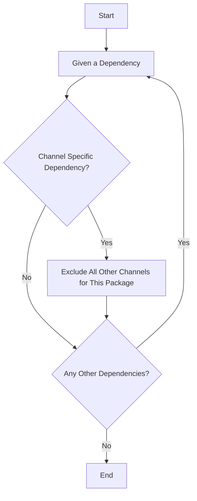
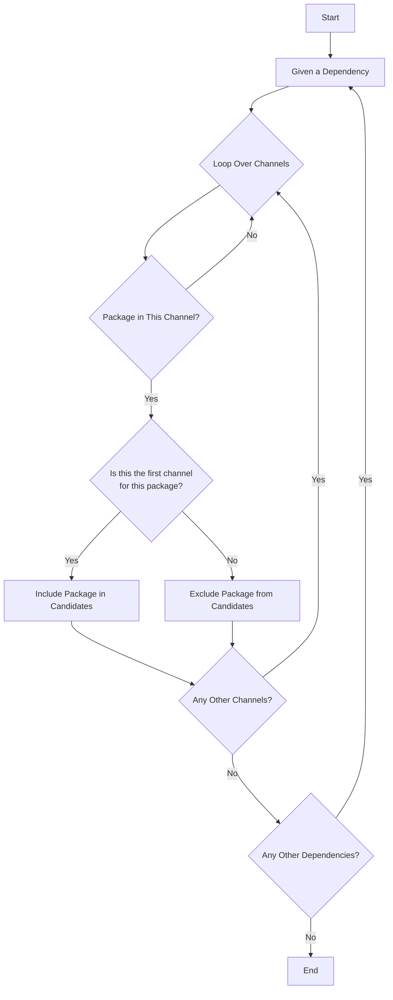

所有关于可以从哪个通道安装依赖的决定逻辑都由我们给求解器的指令完成。

实际代码在 [`rattler_solve`](https://github.com/conda/rattler/blob/02e68c9539c6009cc1370fbf46dc69ca5361d12d/crates/rattler_solve/src/resolvo/mod.rs) crate 中。然而，这可能很难阅读。因此，本文档将继续使用简化的流程图。

## 通道特定依赖

当用户为依赖定义通道时，求解器需要知道其他通道对该依赖不可用。
```toml
[workspace]
channels = ["conda-forge", "my-channel"]

[dependencies]
packgex = { version = "*", channel = "my-channel" }
```
在 `packagex` 示例中，求解器将理解该包仅在 `my-channel` 中可用，而不会在 `conda-forge` 中查找它。

排除所有其他通道的逻辑流程图：



## 通道优先级

通道优先级由 `workspace.channels` 数组中的顺序决定，第一个通道具有最高优先级。
例如：
```toml
[workspace]
channels = ["conda-forge", "my-channel", "your-channel"]
```
如果包在 `conda-forge` 中找到，求解器将不会在 `my-channel` 和 `your-channel` 中查找它，因为它告诉求解器它们被排除。
如果包在 `conda-forge` 中未找到，求解器将在 `my-channel` 中查找，如果**确实**在那里找到，它将告诉求解器为该包排除 `your-channel`。
此图解释了该逻辑：


此方法确保求解器仅在找到的最高优先级通道中找到包时才将其添加到候选列表中。
如果你有 10 个通道且包在第 5 个通道中找到，如果它们也包含该包，它将从候选列表中排除接下来的 5 个通道。

## 用例：pytorch 和 nvidia 与 conda-forge
一个常见的用例是结合使用 `pytorch` 和 `nvidia` 驱动程序，同时还需要 `conda-forge` 通道来获取主要依赖。
```toml
[workspace]
channels = ["nvidia/label/cuda-11.8.0", "nvidia", "conda-forge", "pytorch"]
platforms = ["linux-64"]

[dependencies]
cuda = {version = "*", channel="nvidia/label/cuda-11.8.0"}
pytorch = {version = "2.0.1.*", channel="pytorch"}
torchvision = {version = "0.15.2.*", channel="pytorch"}
pytorch-cuda = {version = "11.8.*", channel="pytorch"}
python = "3.10.*"
```
这将从 `nvidia/label/cuda-11.8.0` 通道获取尽可能多的内容，实际上这只是 `cuda` 包。

然后它将从 `nvidia` 通道获取所有包，这个稍多，有些包与 `nvidia` 和 `conda-forge` 通道重叠。
就像 `cuda-cudart` 包一样，由于优先级逻辑，现在只能从 `nvidia` 通道检索。

然后它将从 `conda-forge` 通道获取包，这是主要依赖的通道。

但用户只想从 `pytorch` 通道获取 pytorch 包，这就是为什么 `pytorch` 被添加在最后，并且依赖项被添加为通道特定依赖项。

我们不在 `conda-forge` 之前定义 `pytorch` 通道，因为我们要从 `conda-forge` 获取尽可能多的内容，因为 pytorch 通道并不总是提供所有包的最好版本。

例如，它也提供 `ffmpeg` 包，但只是一个与更新版本的 pytorch 不兼容的旧版本。
因此，如果我们用优先级逻辑跳过 `conda-forge` 通道的 `ffmpeg`，安装就会失败。

## 强制特定通道优先级
如果你想强制通道的特定优先级，可以使用通道定义中的 `priority`（整数）键。数字越高，优先级越高。
未指定的优先级设置为 0，但数组中的索引仍然计为优先级，其中列表中的第一个具有最高优先级。

此优先级定义对于具有不同通道优先级的[多个环境](../workspace/multi_environment.md) 最为重要，因为默认情况下 feature 通道会预先添加到工作区通道。

```toml
[workspace]
name = "test_channel_priority"
platforms = ["linux-64", "osx-64", "win-64", "osx-arm64"]
channels = ["conda-forge"]

[feature.a]
channels = ["nvidia"]

[feature.b]
channels = [ "pytorch", {channel = "nvidia", priority = 1}]

[feature.c]
channels = [ "pytorch", {channel = "nvidia", priority = -1}]

[environments]
a = ["a"]
b = ["b"]
c = ["c"]
```
此示例创建 4 个环境，`a`、`b`、`c` 和默认环境。
它们将具有以下通道顺序：

| 环境      | 结果通道顺序                |
|----------|--------------------------|
| default  | `conda-forge`            |
| a        | `nvidia`, `conda-forge`  |
| b        | `nvidia`, `pytorch`, `conda-forge` |
| c        | `pytorch`, `conda-forge`, `nvidia` |

??? tip "使用 `pixi info` 检查优先级结果"
    使用 `pixi info` 你可以检查环境中通道的优先级。
    ```bash
    pixi info
    Environments
    ------------
           Environment: default
              Features: default
              Channels: conda-forge
    Dependency count: 0
    Target platforms: linux-64

           Environment: a
              Features: a, default
              Channels: nvidia, conda-forge
    Dependency count: 0
    Target platforms: linux-64

           Environment: b
              Features: b, default
              Channels: nvidia, pytorch, conda-forge
    Dependency count: 0
    Target platforms: linux-64

           Environment: c
              Features: c, default
              Channels: pytorch, conda-forge, nvidia
    Dependency count: 0
    Target platforms: linux-64
    ```
